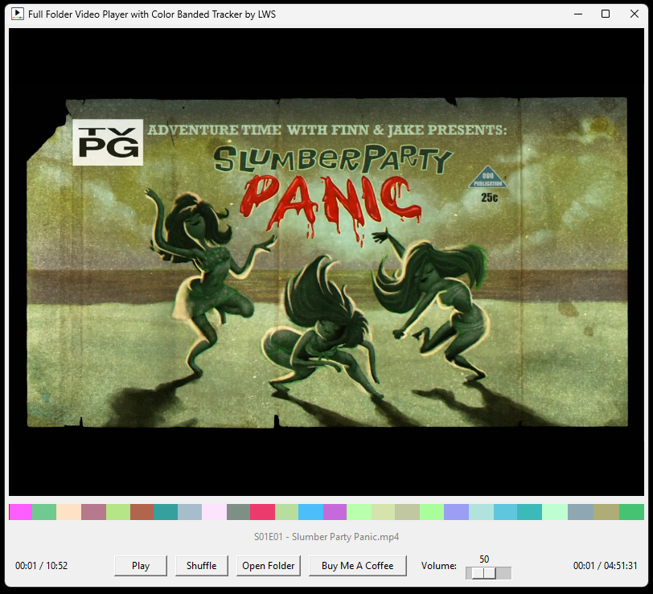

# PlayFolder
Plays a folder full of files with one unified tracking bar distinguished by various colors.

In this preview image you can see the player playing Season 01 of Adventure Time with all of the episodes at the bottom, each as its own unique color on the tracking bar. In the bottom right corner you see the total progress played out of the whole folder. In the bottom left you see the total progress played on the current file.

I added a shuffle button incase you are playing music or something with a non specific order and you don't want the same order each time.

Default order is setup to sort things the way a human would. Like episode 01 before episode 02 for example. But you can also drag the episodes along the tracker to reorder them.

I hope this will be useful to someone other than myself <3

## To Install

In the releases section of github (usually on the right side) download the 1.0 release. It will be a zip file with everything needed to run it. Just place it wherever on your PC you want to store and run it from. Then extract it. Then you seem to be able to run it either by running LWSplayer.exe or player.exe, im not sure what the difference is or why theres two, seems to be a quirk of how I packaged it. So use either one.

|
|
|
|
|
|
|

Please check out my other app too

## VolScroll
Change volume by simply scrolling up or down on a windows title bar.

[https://github.com/Noct-GIT/PlayFolder/tree/main](https://github.com/Noct-GIT/VolScroll)

It has no UI so I can't share a screenshot or else I would.
